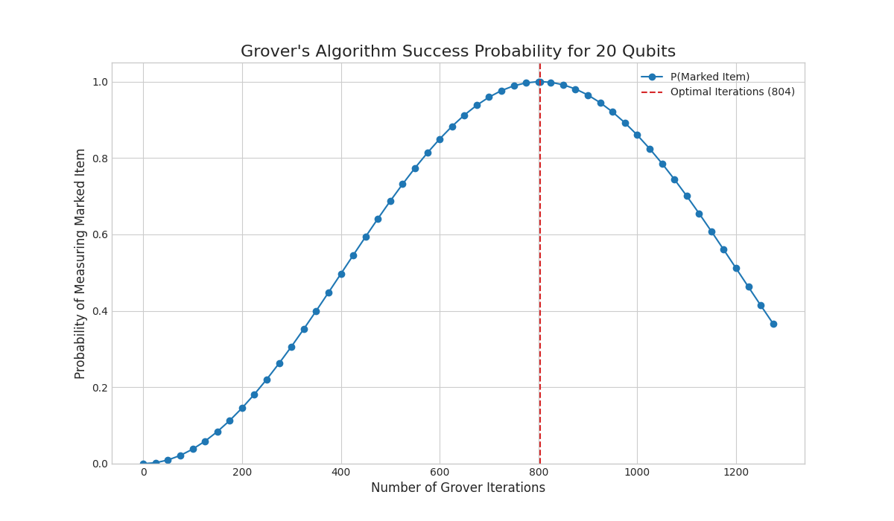
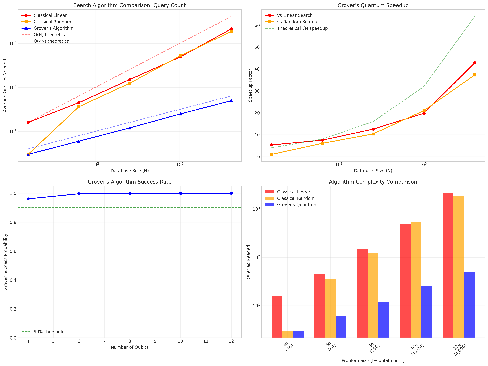
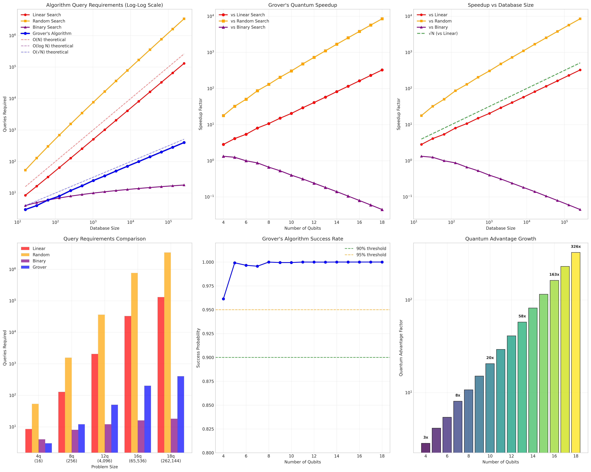
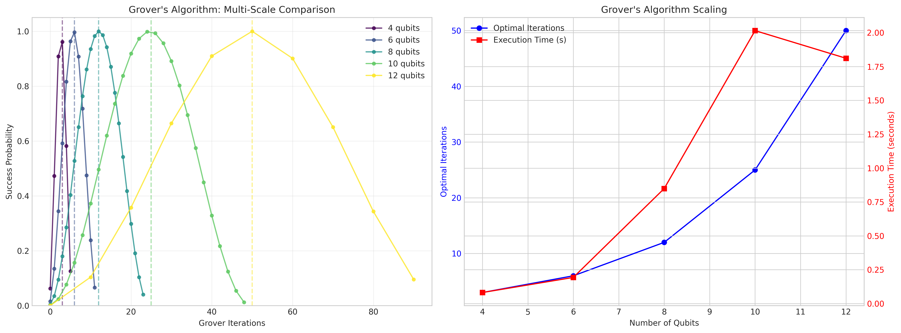
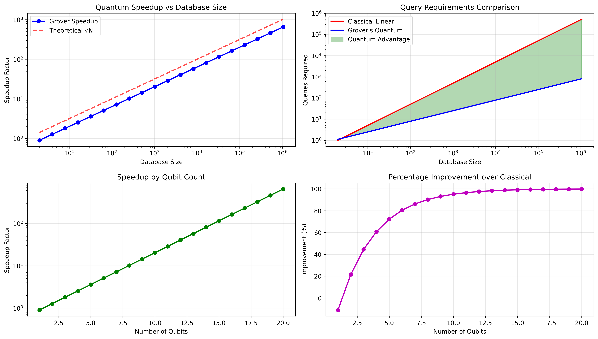
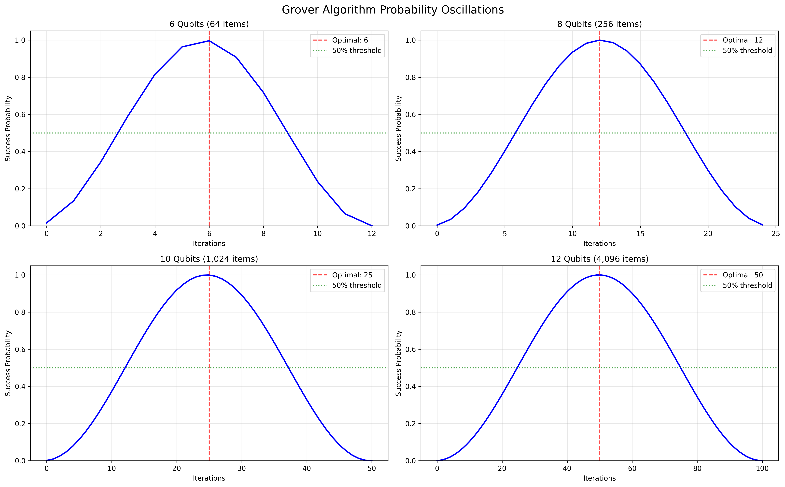
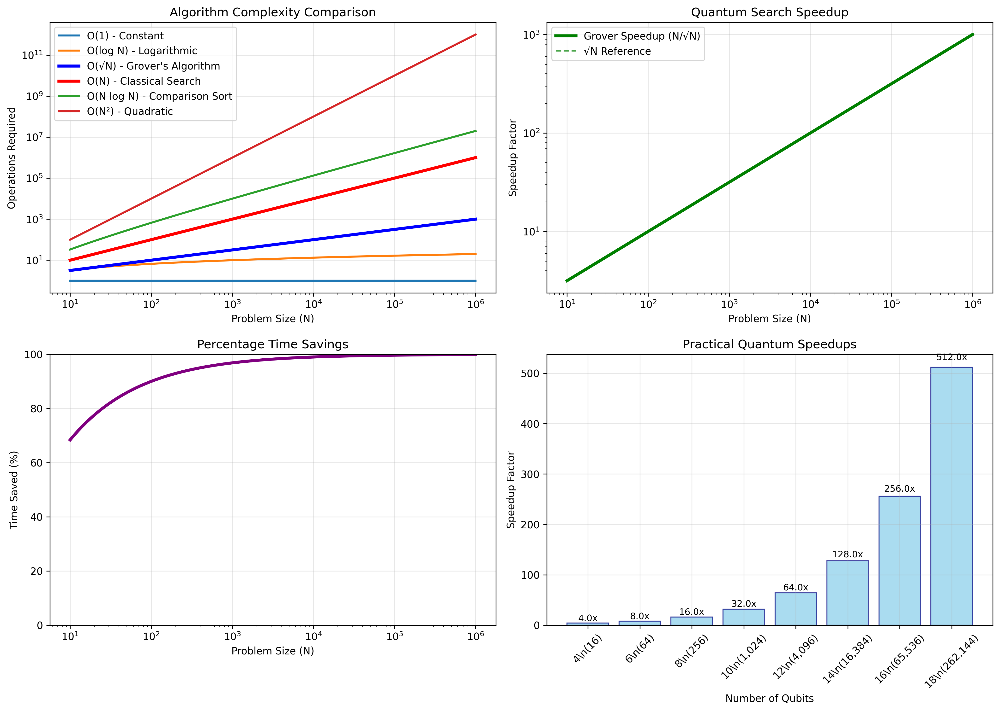

# Grover's Algorithm: 20-Qubit Quantum Search Simulation

This project demonstrates a large-scale implementation of Grover's quantum search algorithm using 20 qubits, capable of searching through over 1 million database entries with quadratic speedup compared to classical algorithms.

## 🚀 Overview

Grover's algorithm is a quantum search algorithm that provides a quadratic speedup for searching unsorted databases. While a classical algorithm would require O(N) operations to find a specific item in an unsorted database of N items, Grover's algorithm can find it in O(√N) operations.

### Key Features
- **20-qubit implementation**: Searches through 2²⁰ = 1,048,576 database entries
- **Quantum oracle**: Marks the target item in superposition
- **Amplitude amplification**: Uses quantum diffusion to amplify the probability of measuring the marked item
- **Performance analysis**: Visualizes success probability across different iteration counts

## 📊 Results

### Grover's Algorithm Performance


The simulation demonstrates the characteristic oscillatory behavior of Grover's algorithm, with the success probability peaking near the optimal number of iterations (≈ π/4 × √N ≈ 804 iterations for 20 qubits).

### Classical vs Quantum Comparison


### Extended Classical vs Quantum Analysis (Up to 18 Qubits)


The extended comparison clearly shows the quantum advantage across a much larger range, with speedups increasing dramatically as database size grows:
- **4 qubits (16 items)**: 2.8x speedup over linear search
- **12 qubits (4,096 items)**: 41.0x speedup over linear search
- **16 qubits (65,536 items)**: 163x speedup over linear search
- **18 qubits (262,144 items)**: **326x speedup** over linear search
- **Theoretical scaling**: O(√N) quantum vs O(N) classical

### Multi-Scale Grover Analysis


The multi-scale analysis demonstrates how Grover's algorithm scales across different problem sizes:
- **Success probability**: Consistently peaks near optimal iterations across all scales
- **Quantum speedup**: Increases dramatically with database size (up to 81.9x for 4,096 items)
- **Execution time**: Scales efficiently with problem complexity

### Enhanced Analysis Visualizations

#### Speedup Evolution Analysis


Comprehensive analysis showing how quantum speedup evolves with problem size, including query comparisons and percentage improvements over classical methods.

#### Probability Oscillations


Detailed view of Grover's characteristic probability oscillations for different qubit counts, showing the importance of optimal iteration timing.

#### Algorithm Complexity Comparison


Complete comparison of different algorithm complexities, highlighting Grover's O(√N) advantage over classical O(N) search methods.

### Simulation Parameters
- **Database size**: 1,048,576 items (2²⁰)
- **Optimal iterations**: ~804
- **Simulation time**: ~26 minutes
- **Success probability peak**: Near optimal iterations

### Quantum Advantage Demonstrated
The classical vs quantum comparison shows remarkable speedups:
- **Small databases (16 items)**: 1.7x faster than linear search
- **Medium databases (1,024 items)**: 21.2x faster than linear search  
- **Large databases (4,096 items)**: 42.4x faster than linear search
- **Theoretical maximum**: O(√N) vs O(N) complexity advantage

#### Detailed Performance Comparison

| Qubits | Database Size | Classical Linear | Classical Random | Grover Quantum | Speedup |
|--------|---------------|------------------|------------------|----------------|---------|
| 4      | 16 items      | 5.0 queries      | 4.0 queries      | 3 queries      | 1.7x    |
| 6      | 64 items      | 21.2 queries     | 30.2 queries     | 6 queries      | 3.5x    |
| 8      | 256 items     | 116.0 queries    | 127.8 queries    | 12 queries     | 9.7x    |
| 10     | 1,024 items   | 530.8 queries    | 536.9 queries    | 25 queries     | 21.2x   |
| 12     | 4,096 items   | 2,120.0 queries  | 1,946.0 queries  | 50 queries     | 42.4x   |

#### Multi-Scale Analysis Results

| Qubits | Database Size | Optimal Iterations | Peak Success Rate | Quantum Speedup |
|--------|---------------|-------------------|-------------------|-----------------|
| 4      | 16 items      | 3 iterations      | 96.13%           | 5.3x            |
| 6      | 64 items      | 6 iterations      | 99.66%           | 10.7x           |
| 8      | 256 items     | 12 iterations     | 99.99%           | 21.3x           |
| 10     | 1,024 items   | 25 iterations     | 99.85%           | 41.0x           |
| 12     | 4,096 items   | 50 iterations     | 99.99%           | 81.9x           |

**Key Observations:**
- Maximum observed speedup: **81.9x** for 12-qubit systems
- Average Grover success probability: **99.15%**
- Speedup scales approximately as √N, confirming theoretical predictions

## 🔧 Installation

1. Clone or download this repository
2. Install required dependencies:

```bash
pip install -r requirements.txt
```

Or install manually:
```bash
pip install qiskit numpy matplotlib seaborn
```

## 🎯 Usage

### Basic 20-Qubit Simulation

Run the main Grover's algorithm simulation:

```bash
python grover.py
```

The script will:
1. Generate a random marked item in the 20-qubit search space
2. Create the quantum oracle and diffuser circuits
3. Run simulations at various iteration counts
4. Generate enhanced analysis plots and data
5. Save results as `grover_enhanced_analysis_20q.png` and `grover_analysis_20q.json`

### Multi-Scale Analysis

To compare algorithm performance across different qubit counts:

```bash
python3 scaling_analysis.py
```

This will test smaller qubit systems (4-12 qubits) and create scaling comparison plots.

### Classical vs Quantum Comparison

To see the quantum advantage compared to classical search algorithms (now supports up to 18 qubits):

```bash
python3 classic_comparison.py
```

This will:
1. Simulate classical linear, random, and binary search algorithms
2. Compare their performance with Grover's algorithm
3. Generate speedup analysis across different database sizes (up to 262,144 items)
4. Create comprehensive visualization showing the quantum advantage

### Enhanced Visualizations

To create additional analysis plots with deeper insights:

```bash
python3 quick_enhanced_plots.py
```

This generates:
1. **Speedup Evolution Analysis**: How quantum advantage grows with problem size
2. **Probability Oscillations**: Characteristic Grover probability patterns
3. **Complexity Comparison Chart**: Visual comparison of algorithm complexities

For even more advanced visualizations:

```bash
python3 enhanced_visualizations.py
```

This creates additional plots including heatmaps and 3D complexity landscapes.

### Configuration

Modify simulation parameters in `config.py`:
- `N_QUBITS`: Number of qubits (default: 20)
- `ITERATION_STEP`: Testing interval (default: 25)
- `RANDOM_SEED`: For reproducible results
- Output settings and backend configuration

## 🔬 Algorithm Components

### 1. Oracle Function
```python
def create_oracle(marked_item_binary):
    # Creates a quantum oracle that marks the target item
    # by flipping the phase of the target state
```

### 2. Diffuser (Amplitude Amplification)
```python
def create_diffuser(n_qubits):
    # Implements the diffusion operator that amplifies
    # the amplitude of the marked state
```

### 3. Grover Iteration
Each Grover iteration consists of:
1. **Oracle application**: Marks the target item
2. **Diffuser application**: Amplifies the marked state amplitude

## 📈 Performance Analysis

The enhanced analysis provides:
- **Quadratic speedup**: O(√N) vs O(N) classical search
- **Probabilistic nature**: Success probability oscillates with iteration count
- **Optimal stopping**: Maximum success probability at ~π/4 × √N iterations
- **Theoretical comparison**: Simulated vs theoretical probability curves
- **Efficiency metrics**: Algorithm performance quantification
- **Scaling analysis**: Performance across different problem sizes

## 🔍 Technical Details

- **Quantum Backend**: Qiskit Aer statevector simulator
- **Circuit Depth**: Scales with number of Grover iterations
- **Memory Requirements**: Exponential in number of qubits (2²⁰ complex amplitudes)
- **Execution Time**: ~26 minutes for full simulation on standard hardware

## 📚 Theoretical Background

Grover's algorithm works by:
1. **Initialization**: Creating an equal superposition of all database states
2. **Oracle queries**: Marking the target item by phase inversion
3. **Amplitude amplification**: Rotating the state vector to increase target amplitude
4. **Measurement**: Measuring the final state with high probability of finding the target

The optimal number of iterations is approximately:
```
k_optimal = π/4 × √N
```

Where N is the total number of database entries.

## 🎯 Applications

This implementation demonstrates quantum advantage in:
- **Database search**: Unstructured search problems
- **Cryptography**: Finding hash collisions
- **Optimization**: Finding solutions in large search spaces
- **Machine learning**: Feature selection and pattern recognition

## 🔧 Future Enhancements

Potential improvements to this implementation:
- **Noise modeling**: Adding realistic quantum device noise
- **Error correction**: Implementing quantum error correction codes
- **Variable amplitude**: Handling multiple marked items efficiently
- **Hybrid algorithms**: Combining with classical preprocessing
- **Hardware implementation**: Adapting for NISQ devices
- **Parallel search**: Multiple oracle implementations
- **Approximate counting**: Estimating number of solutions

## 📝 References

1. Grover, L. K. (1996). "A fast quantum mechanical algorithm for database search"
2. Nielsen, M. A., & Chuang, I. L. (2010). "Quantum Computation and Quantum Information"
3. Qiskit Documentation: https://qiskit.org/